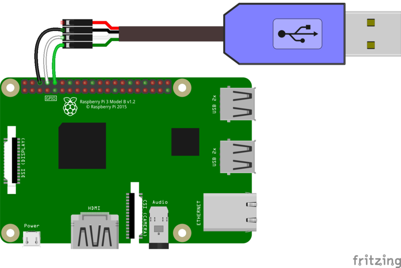
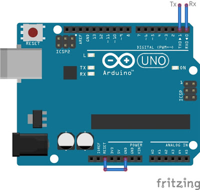

# qnx_ros2_rpi

## Installing QNX on RPi4

### Requirements
```
RPi4 with SD-Card
USB-TTL Serial Cable -or- Arduino and Jumper Cables
MyQNX Account with QNX license
```

### Generate SD-Card

### Serial Communication

With USB-TTL Serial Cable

```
The red lead should not be connected in our case
The black lead to GND (3rd pin down)
The white lead to TXD on the Pi (4th pin down)
The green lead to RXD on the pI (5th pin down)
```

With Arduino

```
on Arduino: 
    connect the RESET pin to GND

between Arduino and RPi:
    Link the GND
    Pin 0 (RX) from Arduino to TX from RPiD (4th pin down)
    Pin 1 (TX) from Arduino to RX from RPiD (5th pin down)
```