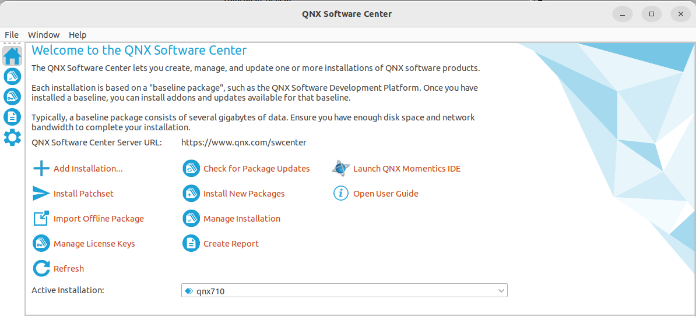
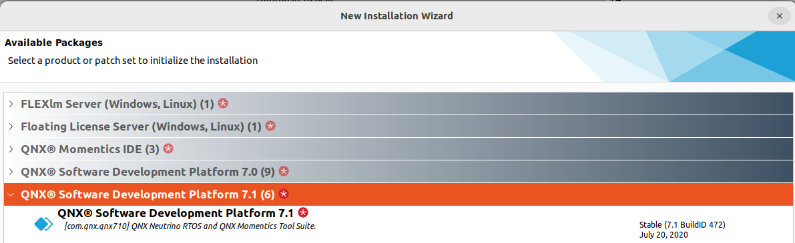
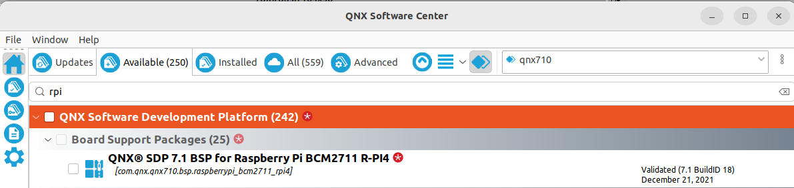

# qnx_ros2_rpi

## Installing QNX on RPi4

### Requirements
```
RPi4 with SD-Card
USB-TTL Serial Cable -or- Arduino and Jumper Cables
MyQNX Account with QNX license
```

### Install QNX Software Center
Download the software center for your system
https://www.qnx.com/download/group.html?programid=29178

In linux use it:
```
chmod +x qnx-setup-2.0-202209011607-linux.run
./qnx-setup-2.0-202209011607-linux.run
```



Install via Add Installation..



Once install is done add the board RPi4 via Manage Installation




Inside qnx710 you should have a bsp folder
```
$ l ~/qnx710/bsp/
BSP_raspberrypi-bcm2711-rpi4_br-710_be-710_SVN946248_JBN18.zip
```

### Generate SD-Card
We can now download and unzip all the needed data
clone this repo
```
export QNX_ROOT=${HOME}/workspace
mkdir -p ${WORKSPACE_ROOT} && cd ${WORKSPACE_ROOT}
git clone https://github.com/flochre/qnx_ros2_rpi.git
cd ${WORKSPACE_ROOT}/qnx_ros2_rpi
./generate-sd-card.bash
```

this will generate a out folder that contain what you should copy on the SD-Card
Make sure to format your SD-card in FAT

### Serial Communication
With USB-TTL Serial Cable

```
The red lead should not be connected in our case
The black lead to GND (3rd pin down)
The white lead to TXD on the Pi (4th pin down)
The green lead to RXD on the Pi (5th pin down)
```

With Arduino

```
on Arduino: 
    connect the RESET pin to GND

between Arduino and RPi:
    Link the GND (3rd pin down from RPi) to any GND of the Arduino
    Pin 0 (RX) from Arduino to TX from RPiD (4th pin down)
    Pin 1 (TX) from Arduino to RX from RPiD (5th pin down)
```

sources:
1. http://www.qnx.com/download/download/56868/SDP710_BSP_UG_RASPBERRYPI_BCM2711_RPI4_Board_20221111.pdf
1. https://www.qnx.com/developers/articles/rel_6836_0.html
1. https://carleton.ca/rcs/qnx/installing-qnx-on-raspberry-pi-4/
1. https://youtu.be/y42V_7ZTa-s